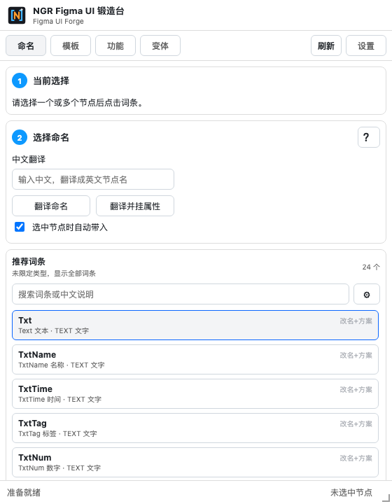

<div align="center">
  
  <h1>NGR Figma UI Forge</h1>
  <p><strong>NGR Figma UI 锻造台</strong> — 面向游戏 UI 生产流程的 Figma 效率插件。</p>
  <p>把节点命名、翻译、共享属性、画板整理、程序控制属性、组件变体和模板插入集中到一个工作台。</p>
  <p>
    <a href="https://github.com/907609732/NGR-Figma-UI-Forge/releases/tag/v0.1.55">下载正式版</a>
    ·
    <a href="https://figma.lttlt.top/">官方网站</a>
    ·
    <a href="https://figma.lttlt.top/tutorial">使用教程</a>
    ·
    <a href="./docs/软件交互文档.md">交互文档</a>
  </p>
</div>



## 产品定位

NGR Figma UI Forge 用于减少游戏 UI 设计和交付中的重复操作。设计师可以在 Figma 内完成规范命名、属性复用、画板整理和组件状态制作，并把结果交给程序或其他测试电脑继续验证。

当前正式版本为 **v0.1.55**，支持 Figma Desktop 导入测试。

## 核心能力

- **节点命名与中文翻译**：根据节点类型推荐词库，支持百度翻译、OpenAI 和 Kimi 辅助命名。
- **共享属性方案**：复用字体、字号、行高、颜色、透明度、位置、约束和圆角等常用属性。
- **一键整理画板**：按规则处理隐藏节点、Group、Mask、画板命名和程序控制属性。
- **程序控制属性**：为文本和图片节点写入项目可识别的 Figma Plugin Data。
- **一键变体**：生成跳转按钮、选择按钮、Checked、Style 和 Disabled 等组合状态。
- **状态层自动切换**：按后代节点名精确控制 `Hover`、`Pressed`、`Disabled` 状态层。
- **模板插入**：支持 Figma Library Component Key 和内置 PC、IOS 画板模板。
- **配置持久化**：词库、属性方案、API 配置和功能开关保存在当前设备。

## v0.1.55 更新重点

- 官方网站迁移到 [`figma.lttlt.top`](https://figma.lttlt.top/)，教程地址同步更新。
- 插件设置、正式版网络白名单、README 和官网统一使用新域名。
- 删除旧的 `uiforge.lttlt.top` 域名入口，保留 v0.1.54 的一键变体状态层能力。

## v0.1.54 功能重点

一键变体新增可选的“按节点名切换状态层”功能。开启后会递归检查组件后代，忽略大小写和首尾空格，只精确匹配 `Hover`、`Pressed`、`Disabled`。

| State | Hover 层 | Pressed 层 | Disabled 层 |
|---|---:|---:|---:|
| Normal | 关闭 | 关闭 | 关闭 |
| Hover | 打开 | 关闭 | 关闭 |
| Pressed | 打开 | 存在时打开 | 关闭 |
| Disabled | 关闭 | 关闭 | 存在时打开 |

- Pressed 状态会同时打开 Hover。
- Checked 和 Unchecked 使用相同的 State 映射。
- 同名节点会全部处理，缺失节点直接跳过。
- `Icon_Hover` 等非精确名称不会被修改。
- 已有 Component Set 追加 Style 时不会启用该功能。

## 下载与安装

### 推荐：GitHub Release

1. 下载 [NGR Figma UI Forge v0.1.55 正式版 ZIP](https://github.com/907609732/NGR-Figma-UI-Forge/releases/download/v0.1.55/NGR-Figma-UI-Forge-v0.1.55.zip)。
2. 将 ZIP 解压到任意固定目录。
3. 打开 Figma Desktop。
4. 进入“插件 → 开发 → 从 manifest 导入插件”。
5. 选择解压目录中的 `manifest.json`。
6. 在测试文件中启动“NGR Figma UI 锻造台”。

正式版只包含 `manifest.json`、`code.js`、`ui.html` 和测试说明，不包含源码、依赖、缓存、API 密钥或本机配置。

### 本地便携包

仓库中的 [`正式版软件/NGR-Figma-UI-Forge-v0.1.55`](./正式版软件/NGR-Figma-UI-Forge-v0.1.55) 与 Release 对应，可直接复制或压缩到其他电脑。

## 使用说明

- 完整功能与页面规则：[软件交互文档](./docs/软件交互文档.md)
- 在线教程：[使用教程](https://figma.lttlt.top/tutorial)
- 正式版本：[GitHub Releases](https://github.com/907609732/NGR-Figma-UI-Forge/releases)
- 问题反馈：[GitHub Issues](https://github.com/907609732/NGR-Figma-UI-Forge/issues)

百度翻译、OpenAI 和 Kimi 功能需要联网，并在插件设置中填写各自的接口配置。仓库和正式版软件不包含任何用户 API 密钥。

## 工作区结构

| 路径 | 用途 |
|---|---|
| `正式版软件/` | 可独立复制、压缩和测试的正式版插件 |
| `docs/` | 软件交互与产品文档 |
| `system/src/` | Figma 插件主线程、共享类型和 UI 源码 |
| `system/dist/` | 开发工作区使用的已构建插件文件 |
| `system/scripts/` | 插件构建脚本 |
| `website/app/` | 官网首页、教程页、布局和样式 |
| `website/public/` | 官网图片、图标和分享图 |
| `website/tests/` | 官网渲染与链接测试 |
| `assets/` | 品牌 SVG 等可编辑源文件 |

根目录的 `manifest.json` 是开发工作区入口，指向 `system/dist`。`hidden_changes.conf` 用于隐藏 Plastic SCM 待处理列表中的工具目录噪音。

## 本地开发

网站工程要求 Node.js 22.13 或更高版本。依赖目录和构建缓存不提交到仓库。

### Figma 插件

```powershell
cd system
npm.cmd ci
npm.cmd run typecheck
npm.cmd run build
```

完成构建后，在 Figma Desktop 中导入仓库根目录的 `manifest.json`。

### 官网

```powershell
cd website
npm.cmd ci
npm.cmd run lint
npm.cmd test
```

## 安全与隐私

- API 配置只写入 Figma 当前设备的插件存储。
- 正式版和仓库不提交 API 密钥、测试账号或本机环境文件。
- 正式版 manifest 仅允许产品功能所需的网络域名，不包含开发环境的任意域名通配权限。
- 导入外部词库或配置前，建议先检查来源和内容。

## 版本信息

- 当前版本：`v0.1.55`
- 更新日期：`2026-08-20`
- 仓库：[`907609732/NGR-Figma-UI-Forge`](https://github.com/907609732/NGR-Figma-UI-Forge)
- Release ZIP SHA-256：`B07B6B978880E41EF1661612C1A75B0825D49BC5ED7EE2F27BFC3EFADA28F7C6`
